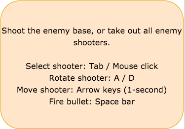

## Sliding Warfare

### Background

Sliding Warfare is a tactical game in which the objective is to either 1) take out the opponent's base or 2) take out all of the opponent's shooters. Two players each control three shooters represented by circles at each end of a 2-D field, which contains walls scattered all over it. Each end contains a square tile that represents the base. Each player then takes turns, performing the following steps:

1) Select one of the shooters.
2) Set the rotation of the selected shooter (this is to adjust where the bullet will fire from the shooter).
3) Move the selected shooter using arrow keys during a 1-second window, after which the shooter will continue to slide and eventually come to a stop.
4) Before the shooter stops moving, the shooter can fire a single bullet.

When an opponent shooter is hit with a bullet, that shooter is then removed from the game. Similarly, if the opponent base gets shot with a bullet, the base is removed, and victory is immediately awarded to the shooting player. Once the bullet hits a wall, it is removed from the game without any additional side effects.

Players must learn to skillfully control their sliding shooters and utilize walls and come up with strategies to win the game.

### Functionality & MVP  

In Sliding Warfare, users will be able to:

- [ ] Select shooters that they want to move
- [ ] Adjust rotation of the chosen shooter
- [ ] Slide the shooter around and have three "actions" per turn
- [ ] Take out opponent shooters and base

In addition, this project will include:

- [ ] An About modal describing the background and rules of the game
- [ ] A production Readme

### Wireframes

This game will have a modal that includes directions before starting the game. The game itself will take up most of the browser window, with the title of the game at the top along with some short reminder of the controls. At the bottom will be a link to the Github with my name.

The directions modal.

The game screen.

### Architecture and Technologies

This project will be implemented with the following technologies:

- Vanilla JavaScript and `jquery` for overall structure and game logic,
- `Easel.js` with `HTML5 Canvas` for DOM manipulation and rendering,
- Webpack to bundle and serve up the various scripts.

In addition to the webpack entry file, the following scripts will be involved in this project:

`rigid_object.js`: This script will contain the class for rigid objects like walls and the base. These will store area data.
`sliding_object.js`: This script will contain the class for sliding objects such as the shooters and bullets. Each sliding object will contain a position and a velocity state. Shooters will also need to keep track of rotation.
`board.js`: This script will contain the game board, which will consist of many sliding objects and rigid objects. The board will also contain logic for handling collisions.
`game_view.js`: This script will bind all key handlers as well as setting intervals for sliding and when users can shoot.

### Implementation Timeline

**Day 1**: Preliminary setup of all the Node modules. Look into `Easel.js` and research how it could help with all the rendering of HTML5 Canvas. Set up `webpack.config.js` as well as `package.json`. Set up the barebones for all the scripts above, and check to make sure all logic is sound. Goals for the day:

- Set up `webpack`
- Learn enough `Easel.js` to render an object to the `Canvas` element
- Barebones rendering of sliding and rigid objects

**Day 2**: This day will be dedicated to getting all relationships to work between sliding and moving objects. Specifically, I want to get selections, rotations, and sliding translations logic all worked out. Goals for the day:

- Complete rendering of sliding and rigid objects
- Incorporate these objects onto `board.js`
- Make shooters clickable and selectable
- Get rotation and translation to work.

**Day 3**: Finish up rotation and translation of shooters, and incorporate physics for when they run into walls as well as implementing friction. Set up bullets to fire appropriately. Also, set up the game so that players can take turns. Goals for the day:

- Set up all collision logic
- Render bullets, and make sure they fire correctly
- Set up turn-taking logic

**Day 4**: Install the controls for the user to interact with the game.  Style the frontend, making it polished and professional.  Goals for the day:

- Have a styled `Canvas`, nice looking controls and title

### Bonus features

Some additional feature that can be included for Sliding Warfare are the following:

- [ ] Include a somewhat intelligent AI for 1 P options
- [ ] Allow for different terrains
- [ ] Allow for different kinds of weapons
